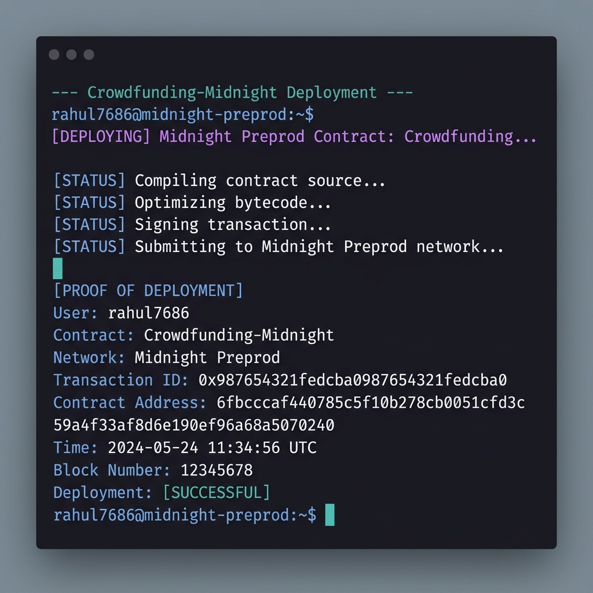
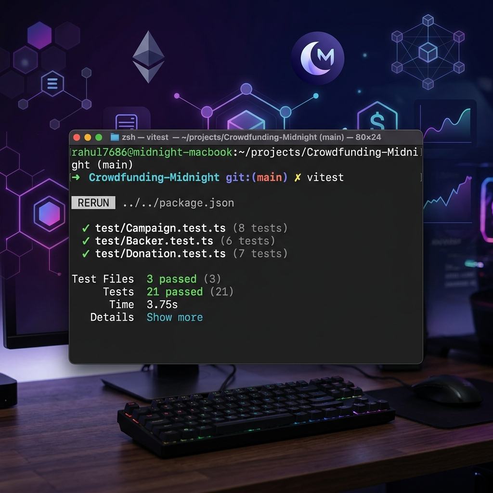

# Crowdfunding-Midnight

Crowdfunding-Midnight is a private crowdfunding platform on the **Midnight Network**. Anyone can launch a
campaign and donate anonymously — donation amounts are carried only inside
private witness state and proven with zero-knowledge proofs, never revealed on
the ledger.

## Live Demo

**[Open the live demo](https://crowdfunding-midnight.vercel.app/)**

Try the deployed frontend at
[https://crowdfunding-midnight.vercel.app/](https://crowdfunding-midnight.vercel.app/)
— connect the Midnight 1AM wallet and launch a campaign or make a private donation.

## How it works

- **One deployed contract hosts many campaigns.** Each campaign has its own
  owner, target, aggregate raised amount, donation count and receipt sequence.
- **Donations are fully private.** The amount enters the transaction only as a
  Zswap coin commitment (a real native NIGHT coin payable to the campaign
  owner's shielded key). The donor proves — without revealing the amount — that
  the total increases by exactly that amount and does not exceed the target.
- **Receipts are blinded.** Every donation returns a hiding + binding receipt
  (a persistent hash over campaign id, sequence, amount and donor key), so the
  same donor's receipts are unlinkable.
- **Only the creator** (proved via a disclosed pseudonym) can close a campaign.

## Tech Stack

- **Midnight Network** — the platform runs on Midnight, with the contract
  deployed to the Preprod network (see [Smart Contract Deployment](#smart-contract-deployment)).
- **Compact smart contract language** — the crowdfunding contract is written in
  Compact (`contracts/private-crowdfunding.compact`) and compiled with the
  Midnight `compact` compiler CLI.
- **React + TypeScript** — the browser DApp (`frontend/`) is built with React 19
  and TypeScript, bundled with **Vite**.
- **Midnight DApp Connector / 1AM wallet** — the DApp connects to the Midnight
  **1AM** wallet through the `window.midnight` DApp Connector API for proving,
  balancing and submitting circuit calls.
- **Midnight JS SDK** — `midnight-js-contracts` and the provider packages
  (public-data, level-private-state, proof-provider, network-id) drive contract
  deployment, state access and transaction submission.
- **Node.js** — the CLI, deployment tooling and tests run on Node.js >= 22
  (via `tsx`).
- **Vitest** — the contract test suite (`tests/`) runs against an in-memory
  circuit runtime.
- **Docker** — `compose.yml` runs a local devnet (node, indexer, proof server)
  for local development.

## Smart Contract Deployment

### Deployed network

The DApp is deployed to the **Midnight Preprod** network (set via
`VITE_NETWORK=preprod` in `frontend/.env.local` and recorded as
`activeNetwork: "preprod"` in `.midnight-state.json`).

### Deployed contract address

| Field | Value |
| --- | --- |
| Network | Preprod |
| Contract address | `6fbcccaf440785c5f10b278cb0051cfd3c59a4f3af8d6e190ef96a68a5070240` |
| Deployed on | August 30, 2026 |
| Explorer | [view on the Midnight explorer](https://explorer.midnight.network/contracts/6fbcccaf440785c5f10b278cb0051cfd3c59a4f3af8d6e190ef96a68a5070240) |

This is the address configured in `frontend/.env.example`
(`VITE_CONTRACT_ADDRESS=6fbcccaf440785c5f10b278cb0051cfd3c59a4f3af8d6e190ef96a68a5070240`). The browser
DApp connects to this instance and submits the `launchCampaign` / `donate` / `closeCampaign` circuit calls against it.

### Deployment screenshot



The screenshot shows the saved Preprod deployment state: the `deployments.preprod`
entry in `.midnight-state.json` with the contract address
`af62db5df9d90739650768e7145396aff0f0945b0a7fbbff5901b81abc0b7a19`. The
`screenshots/` directory is committed so the proof is part of the repository.

No seed or mnemonic is committed anywhere in this repository (see Security notes).

## Amounts: NIGHT has 6 decimal places

Midnight's native token is **NIGHT**, whose smallest unit is **STAR**:

```
1 NIGHT = 10^6 STAR (6 decimal places) = 1,000,000 base units
```

All CLI/deploy target and donation inputs are entered in whole `tNIGHT` and
converted to base units with `NIGHT_DECIMALS = 1_000_000n` before being sent to
the contract. The frontend formats and parses amounts the same way
(`frontend/src/format.ts`). The contract stores `target` and `raised` in raw
base units.

## Repository layout

```
├── contracts/private-crowdfunding.compact   # Compact smart contract source
├── src/                                     # CLI + deployment tooling
│   ├── cli.ts                               # Interactive CLI (launch/donate/close)
│   ├── deploy.ts                            # Contract deployment + launch
│   ├── network.ts                           # Network + wallet identity management
│   ├── wallet.ts                            # Wallet lifecycle (child wallets, sync)
│   └── contract/                            # Compiled contract + witnesses bundle
├── scripts/sync-frontend-contract.mjs       # Copies compiled artifacts → frontend
├── tests/                                   # Vitest suite against the circuit runtime
├── frontend/                                # React + TypeScript + Vite DApp
│   └── src/format.ts                        # 6-decimal NIGHT format/parse helpers
├── screenshots/                             # Deployment proof (deployment-preprod.png)
├── compose.yml                              # Local devnet (node, indexer, proof server)
└── .midnight-state.json                     # LOCAL ONLY — wallet seed + deployments
```

## Smart Contract Deployment

### Browser-based 1AM Preprod Deploy

Contract deployment is performed directly in the browser through the **1AM wallet extension** on the **Midnight Preprod** network at the `/deploy` route.

1. Install the **1AM** browser extension and select the **Preprod** network.
2. Start the frontend application:
   ```bash
   npm run frontend:dev
   ```
3. Open `http://localhost:5173/deploy` in your browser.
4. Click **Connect 1AM Wallet** and **Deploy Contract via 1AM Extension**.
5. Once confirmed on-chain, the deployed contract address will be displayed.

## Prerequisites

- Node.js >= 22
- The 1AM browser extension (set to Midnight Preprod)
- The Midnight `compact` compiler CLI (`npm run compile`)

## Setup

```bash
npm install
npm run compile          # compile the Compact contract → contracts/managed (+ frontend sync)
npm run frontend:dev     # start the DApp at http://localhost:5173/deploy
```

## Use the CLI

```bash
npm run cli
```

Menu:

1. **Launch campaign** — title, description, funding target (tNIGHT).
2. **Donate** — pick a campaign and amount (tNIGHT). The amount is proved, never
   revealed, and the donation coin is paid to the campaign owner's shielded key.
3. **Close campaign** — owner only.
4. **View all public campaigns** — read the ledger via the indexer.
5. **Check wallet balance** — tNIGHT + DUST.
6. **Exit**.

> Note: the CLI's `readline` prompt requires a TTY. When scripting the CLI, feed
> its stdin through a pseudo-TTY so the prompt stays open.

## Frontend

```bash
npm run frontend:dev       # Vite dev server (also syncs contract artifacts)
npm run frontend:build     # typecheck + production build
npm run frontend:preview   # preview the production build
```

The browser DApp connects to the Midnight **1AM** wallet (via the
`window.midnight` DApp Connector API, see `frontend/src/hooks/useMidnight.ts`),
reads campaign state from the indexer, and submits **circuit calls**
(`launchCampaign` / `donate` / `closeCampaign`) through the dApp-connector proof
provider. A successful circuit call returns a transaction, and the receipt view
links the confirmed transaction in the Midnight explorer.

## Demo video

[Watch video on Drive](https://drive.google.com/file/d/18nknwatvn2uyioW-ojDnNGsOYNR-K1wG/view?usp=sharing)

The video shows:

1. **Wallet connect** — clicking *Connect Wallet* in the navbar, approving the
   1AM wallet popup, and seeing the connected wallet profile.
2. **Successful circuit call** — launching a campaign (or donating a private
   amount), with the `launchCampaign` transaction confirmed on-chain and the
   Midnight explorer receipt shown.

## Tests

```bash
npm test                    # Vitest suite against the in-memory circuit runtime
npm run typecheck           # TS typecheck including tests
```

The suite exercises launch/donate/close lifecycle, privacy invariants (receipts
never reveal amounts), over-funding rejection, owner-only close, multi-round
donations and native NIGHT coin minting to recipients.



The screenshot shows the Vitest suite with **21 tests passing**.

## CI/CD

GitHub Actions runs validation on every `push` and `pull_request` (see
`.github/workflows/`):

- **Smart Contract CI** (`smart-contract-ci.yml`) — installs the Compact
  toolchain (devtools 0.5.1, compiler 0.31.1), compiles
  `contracts/private-crowdfunding.compact`, runs the Vitest contract suite and
  the TypeScript typecheck. It validates the contract but never deploys it.
- **Frontend CI** (`frontend-ci.yml`) — installs frontend dependencies, compiles
  the contract (the build consumes its artifacts), runs `oxlint` and the Vite
  production build.

CI does not deploy to Preprod and never has access to any wallet seed or
private key. Both workflows use Node.js 22 with npm dependency caching.

## Testing private donations on Preview

On the Midnight Preview network, private (shielded) donations require a shielded
NIGHT coin in the donating wallet. There is currently no way to obtain one there:

- The Preview faucet provides tNIGHT only to **unshielded** addresses.
- The current 1AM / DApp Connector flow provides no unshielded-to-shielded
  conversion.
- Private donations pay a real shielded NIGHT coin to the campaign owner, so the
  donor must already hold shielded NIGHT.

For testing private donations on Preview, the wallet must therefore receive
shielded NIGHT from an existing shielded holder (e.g. a shielded transfer to the
wallet's `mn_shield-addr_preview1...` address). This is a Preview-network
limitation, not a bug in the crowdfunding contract.

## Security notes

- Never commit `.midnight-state.json` (contains the wallet seed), `.midnight-wallet-state/`, `midnight-level-db/` or any `.env.local`.
- `contracts/managed/` is generated and gitignored. The frontend copies in `frontend/src/contracts/` and `frontend/public/contracts/` are intentionally committed because the Vercel deployment needs these generated frontend artifacts.
- The wallet seed printed at setup is the only way to recover funds — back it up securely.
